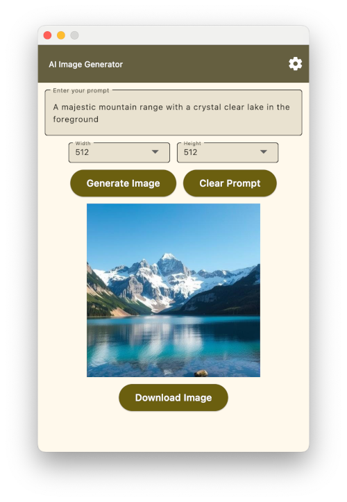

# AI Image Generator

This is an AI Image generator built using Python Flet. Image generation uses the Flux.1 model; dev and schnell variants served via a DeepInfra API. You will need an API key from DeepInfra.

## Getting Started

### Obtain DeepInfra API Key:

1. Visit [DeepInfra](https://deepinfra.ai/) and sign up for an account.
2. Obtain your API key from your account dashboard.

### Configure the API Key:

1. Create a file named `config.py` in the same directory as your main script.
2. Add the following code to `config.py`, replacing `<YOUR_API_KEY>` with your actual DeepInfra API key:

### Usage

1. **Input Prompt**: Enter your desired image prompt in the text field.
2. **Select Model**: Choose either the `dev` or `schnell` variant of the Flux.1 model.
3. **Generate Image**: Click the "Generate Image" button to generate the image.
4. **View Image**: The generated image will be displayed in the image widget.

### Features

- User-friendly interface built with Flet.
- Integration with DeepInfra API for image generation.
- Support for Flux.1 model variants (`dev` and `schnell`).

### Example

- **Prompt**: A majestic mountain range with a crystal clear lake in the foreground.
- **Output**:  
  

### Note

This project is still under development. Feel free to contribute to its improvement!