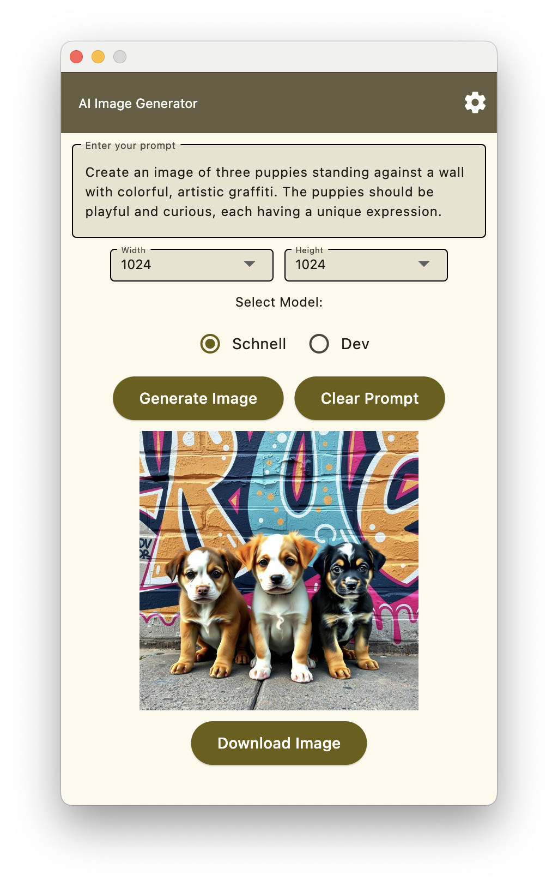

# AI Image Generator

This simple AI image generator is built using Python and Flet, utilizing the Flux.1 model, including both the ‘dev’ and ‘schnell’ variants, served via the DeepInfra API. To use it, you will need a DeepInfra API key. Currently, it is only compatible with macOS.

## Getting Started

### Obtain DeepInfra API Key:

1. Visit [DeepInfra](https://deepinfra.ai/) and sign up for an account.
2. Obtain your API key from your account dashboard.

### Configure the API Key:

1. Navigate to the settings page by clicking on the settings icon (cog wheel).
2. Paste your API key.
3. Save and exit the settings page.

### Usage

1. **Input Prompt**: Enter your desired image prompt in the text field.
2. **Select Model**: Choose either the `dev` or `schnell` variant of the Flux.1 model. The default is `schnell`.
3. **Select Image Dimensions**: Choose your image dimensions. The default is `512` by `512`.
4. **Generate Image**: Click the "Generate Image" button to generate the image.
5. **View Image**: The generated image will be displayed in the image widget. You can download the image using the "Download Image" button.

### Features

- User-friendly interface built with Flet.
- Image generation using Flux.1 AI models (`dev` and `schnell`) through the DeepInfra API.
- View and download generated images.
- Light and dark mode support.

### Example

- **Prompt**: Create an image of three puppies standing against a wall with colorful, artistic graffiti. The puppies should be playful and curious, each having a unique expression.
- **Output**:  
  

### Note

This project is still under development.